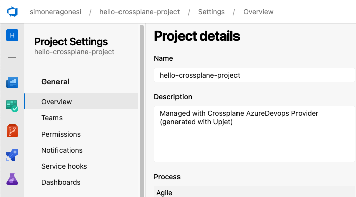

# Crossplane AzureDevops Provider

<p float="left">
  
  
</p>


<br/>
<br/>


<br/>

`provider-azuredevops` is a [Crossplane](https://crossplane.io/) provider that
is built using [Upjet](https://github.com/upbound/upjet) code
generation tools and exposes XRM-conformant managed resources for the
AzureDevops API.

## Getting Started

Install the provider by using the following command after changing the image tag
to the [latest release](https://marketplace.upbound.io/providers/r3drun3/provider-azuredevops):
```
up ctp provider install r3drun3/provider-azuredevops:v0.1.0
```

Alternatively, you can use declarative installation:
```
cat <<EOF | kubectl apply -f -
apiVersion: pkg.crossplane.io/v1
kind: Provider
metadata:
  name: provider-azuredevops
spec:
  package: r3drun3/provider-azuredevops:v0.1.0
EOF
```

Notice that in this example Provider resource is referencing ControllerConfig with debug enabled.

You can see the API reference [here](https://doc.crds.dev/github.com/r3drun3/provider-azuredevops).

## Developing

Run code-generation pipeline:
```console
go run cmd/generator/main.go "$PWD"
```

Run against a Kubernetes cluster:

```console
make run
```

Build, push, and install:

```console
make all
```

Build binary:

```console
make build
```

## Local development and demo
clone this repo:  
```console
git clone https://github.com/R3DRUN3/provider-azuredevops.git && cd provider-azuredevops
```

<br/>

Start a local `kubernetes` cluster (we will use `kind`):  
```console
kind create cluster --config ./k8s-local/kind-config.yml
```
<br/>

Now we can generate our Upjet Provider:  
```console
make generate
```
<br/>

`Note`: In case the previous command gave you the `panic: cannot run goimports for apis folder: bash: goimports: command not found` error, on macOS you can run:  
```console
export PATH="$PATH:$HOME/go/bin" && make generate
```
<br/>

Apply Custom Resource Definitions:  
```console
kubectl apply -f package/crds
```

<br/>

Under `examples/providerconfig` create a kubernetes secrets with your azuredevops org url and access token:  
```console
cat <<EOF > examples/providerconfig/secret.yaml
apiVersion: v1
kind: Secret
metadata:
  name: example-creds
  namespace: crossplane-system
type: Opaque
stringData:
  credentials: |
    {
      "personal_access_token": "your azure devops personal access token",
      "org_service_url": "your azure devops org url"
    }
EOF
```
<br/>

Run the provider:  
```console
make run
```
<br/>

*Note*: if you see error when launching the `make` command, try to run the following command first:  
```console
git rm --cached build && git submodule add https://github.com/upbound/build build
```
<br/>

Now open a new terminal and apply all the required resources:  
```console
kubectl create namespace crossplane-system --dry-run=client -o yaml | kubectl apply -f - \
&& kubectl apply -f examples/providerconfig/ \
&& kubectl apply -f examples/project/project.yaml \
&& kubectl apply -f examples/gitrepository/gitrepository.yaml
```

<br/>
This will create a new azure devops project in your organization:  
<div style="width: 60%; height: 60%">

  
</div>

<br/>

To retrieve the created resources run the following command:  
```console
kubectl get managed

NAME                                                                          READY   SYNCED   EXTERNAL-NAME                          AGE
repository.gitrepository.azuredevops.upbound.io/hello-crossplane-repository   True    False    e03861d4-ce5d-43cc-899e-ed4a4c99d5d0   14m

NAME                                                              READY   SYNCED   EXTERNAL-NAME                          AGE
project.project.azuredevops.upbound.io/hello-crossplane-project   True    True     7482fede-2c79-402c-b730-5dfafb1b5a24   24m
```

<br/>

If you want to check resource status use the `describe` command, for example:  
```console
k describe repository.gitrepository.azuredevops.upbound.io/hello-crossplane-repository 
```
<br/>

If you want to delete the created resource on azure, simply run:  
```console
kubectl delete -f examples/project/project.yaml
```

<br/>


## Report a Bug

For filing bugs, suggesting improvements, or requesting new features, please
open an [issue](https://github.com/r3drun3/provider-azuredevops/issues).
